# Credits Themes

The stream-end credits view ships with **38 built-in themes** plus a **🎲 Random / Shuffle**
option. Pick one from the **Theme** dropdown in the script's startup settings (Firebot ▸ Settings ▸
Scripts ▸ Startup Scripts) — no rebuilding. **Classic Film** is the default; **🎲 Random / Shuffle**
rolls a different theme every time you generate credits. Your **Custom CSS** is layered on top of
the chosen theme and always wins, so you can tweak any look without editing code.

Every theme is a self-contained CSS "look" over the same credit data, tuned for OBS's Chromium
browser source at 60fps. Each entry below shows its **intro** (left) and **outro** (right) frame —
skim the index, then jump to any theme for the pair. Row and finale treatments vary per theme too.

> Tip: for the smoothest crawl, set the OBS browser source to **60 FPS** with hardware
> acceleration on. See [`docs/INSTALL.md`](docs/INSTALL.md) for the full theming + speed options.

## Index

| | Theme | The look |
|:--:|:--|:--|
| <a href="#classic-film">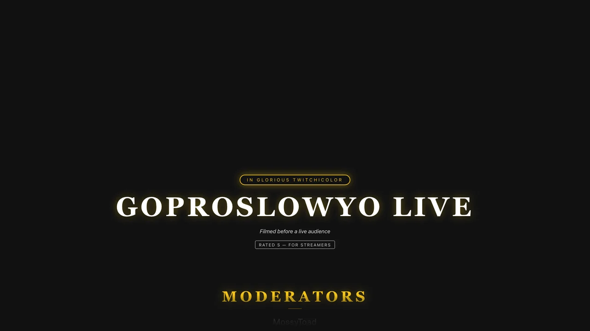</a> | **[Classic Film](#classic-film)** CINEMATIC & CLASSIC | The default: a warm gold-on-black movie crawl with a Playfair serif, glowing section titles, and film-style intro/outro flourish cards. |
| <a href="#space-crawl">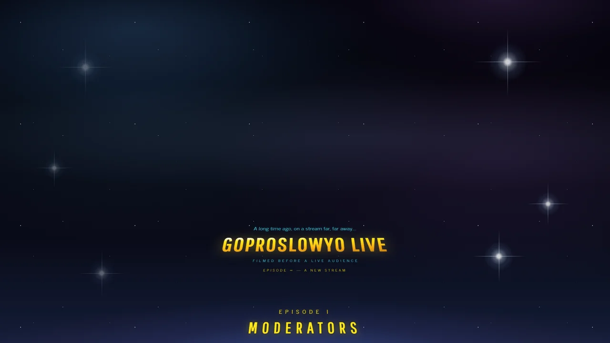</a> | **[Space Crawl](#space-crawl)** CINEMATIC & CLASSIC | The space-opera homage — golden text recedes up a steeply tilted plane, converging to a true vanishing-point apex in a deep starfield toward a glowing galactic core. |
| <a href="#mission-control">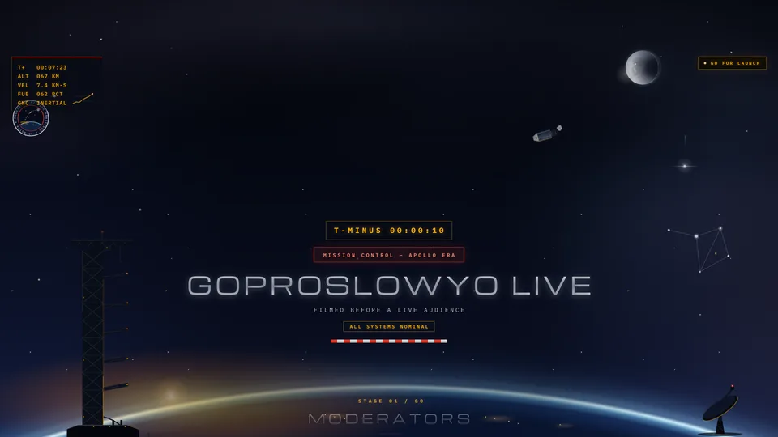</a> | **[Mission Control](#mission-control)** CINEMATIC & CLASSIC | Apollo-era launch: a Saturn V climbs the left third on a flame, live telemetry (`T+ / ALT / VEL`) in the corner, an Earth-limb sunrise across the bottom. |
| <a href="#broadway-playbill">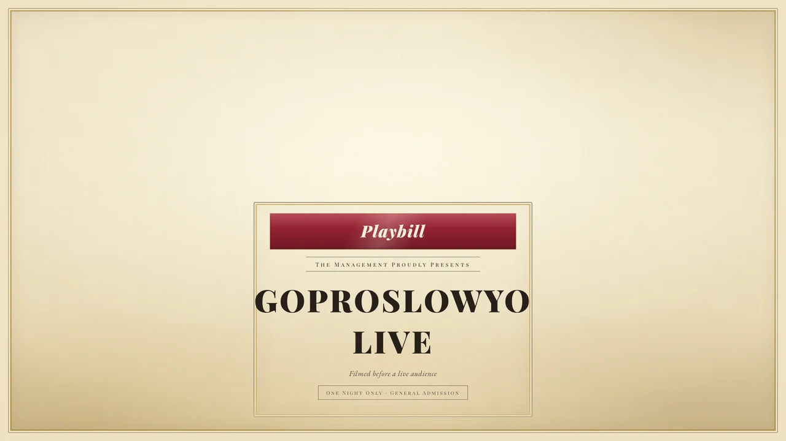</a> | **[Broadway Playbill](#broadway-playbill)** CINEMATIC & CLASSIC | An engraved theatre programme on gold-stamped cream stock, framed by velvet legs and valance — a roving follow-spot, a footlight twinkle chase, the one light theme. |
| <a href="#quest-log">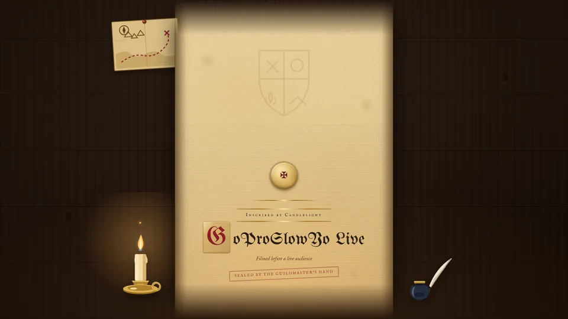</a> | **[Quest Log](#quest-log)** CINEMATIC & CLASSIC | A candlelit tavern ledger on night-stained parchment — a flickering candle and drifting embers, blackletter quest headings with an illuminated drop-cap, ruled sign-in rows with "× N" tallies, a wax-seal outro. |
| <a href="#neon-night-drive">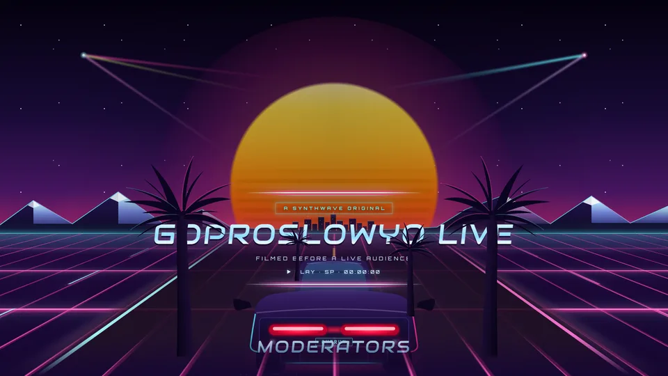</a> | **[Neon Night Drive](#neon-night-drive)** RETRO, SYNTH & TERMINAL | OutRun at 2AM: a hero coupe drives toward the vanishing point over a neon road grid, palms rushing past, a striped sun and city-and-mountain skyline behind, twin 3-beam lasers scissoring magenta and cyan, a high-score-style roster, neon-tube outro. |
| <a href="#vhs-home-video">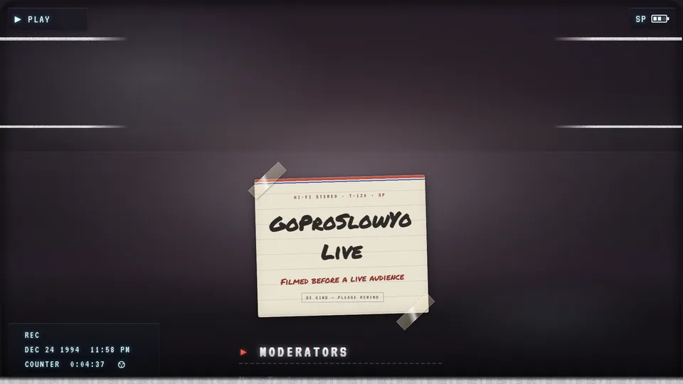</a> | **[VHS Home Video](#vhs-home-video)** RETRO, SYNTH & TERMINAL | A taped-off-air family recording — soft white text with chromatic fringing, VCR OSD chrome (`▶ PLAY`, blinking `● REC`, a 1994 timestamp), a periodic tracking-glitch band. |
| <a href="#phosphor-terminal">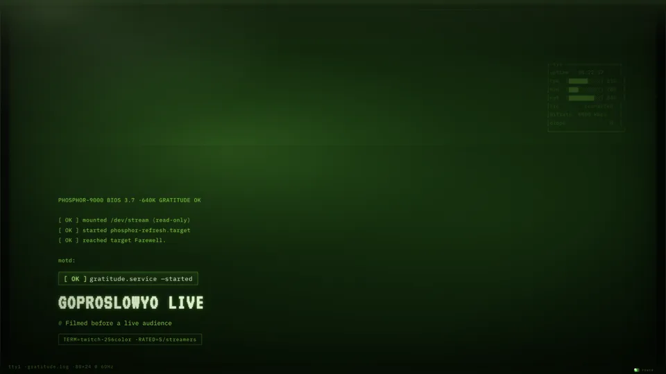</a> | **[Phosphor Terminal](#phosphor-terminal)** RETRO, SYNTH & TERMINAL | A hacker's CRT tty: green-phosphor monospace transcript, `$ cat subscribers.log` section commands, `cat -n` line numbers, scanlines, an amber `tail -f raids.log` finale. |
| <a href="#arcade-high-score">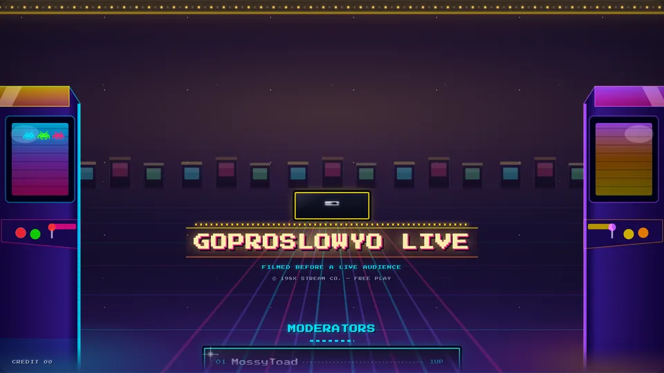</a> | **[Arcade High Score](#arcade-high-score)** RETRO, SYNTH & TERMINAL | An arcade in attract mode: a flanking cabinet running a Space-Invaders demo, a back wall of distant cabinets over a neon floor fan, Press Start 2P ranked HIGH SCORES panels with `PTS`, a blinking `INSERT COIN` badge, a `GAME OVER` outro. |
| <a href="#dot-matrix">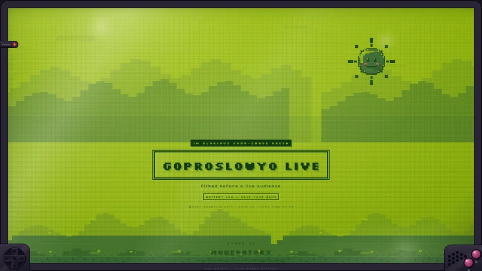</a> | **[Dot Matrix](#dot-matrix)** RETRO, SYNTH & TERMINAL | The 4-shade olive-green handheld LCD — chunky pixel font, a faint dot-grid over the roll, a molded console bezel with A/B buttons, `THANKS FOR PLAYING!` outro. |
| <a href="#roller-disco">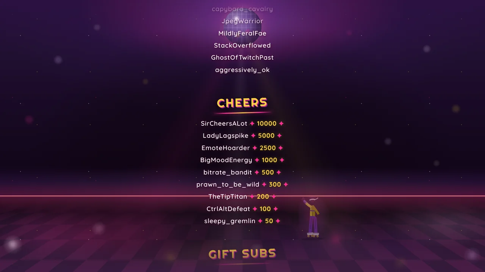</a> | **[Roller Disco](#roller-disco)** MUSIC & DJ | A full rink under a mirror ball — an ensemble of **seven** hand-drawn skaters strides, weaves, high-fives and near-misses across a 2.5D checkered floor, sparkle bursts and all. |
| <a href="#on-deck">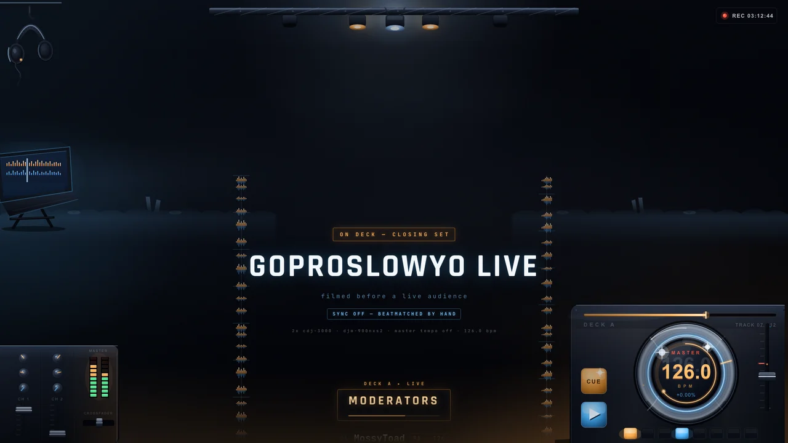</a> | **[On Deck](#on-deck)** MUSIC & DJ | A club DJ booth close-up: a photoreal CDJ jog wheel with a lit `126.0 BPM` display, a mixer strip with VU meters, waveform ribbons, `DECK A / DECK B` sections, tracks tagged with key + BPM. |
| <a href="#warehouse-rave">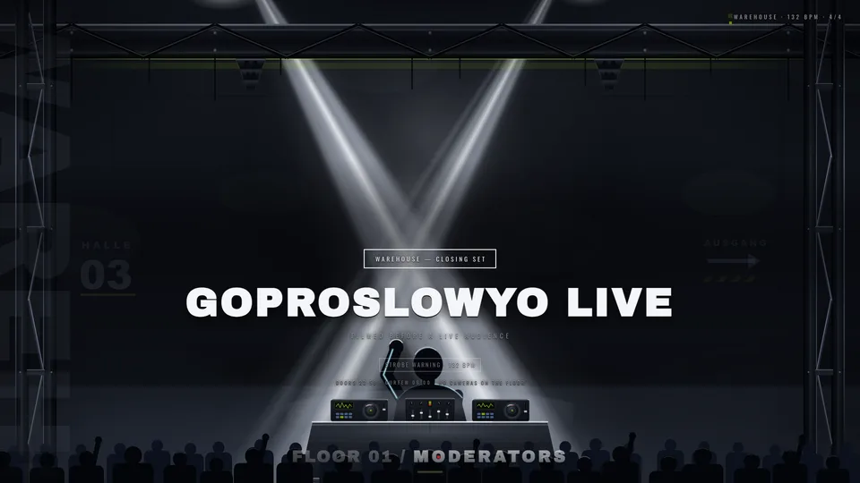</a> | **[Warehouse Rave](#warehouse-rave)** MUSIC & DJ | A Berlin-industrial concrete room: monolithic white type under volumetric beam shafts full of dust, a rim-lit DJ booth, catwalk and PA stacks, a 132-BPM beat dot, a curfew outro. |
| <a href="#deep-house">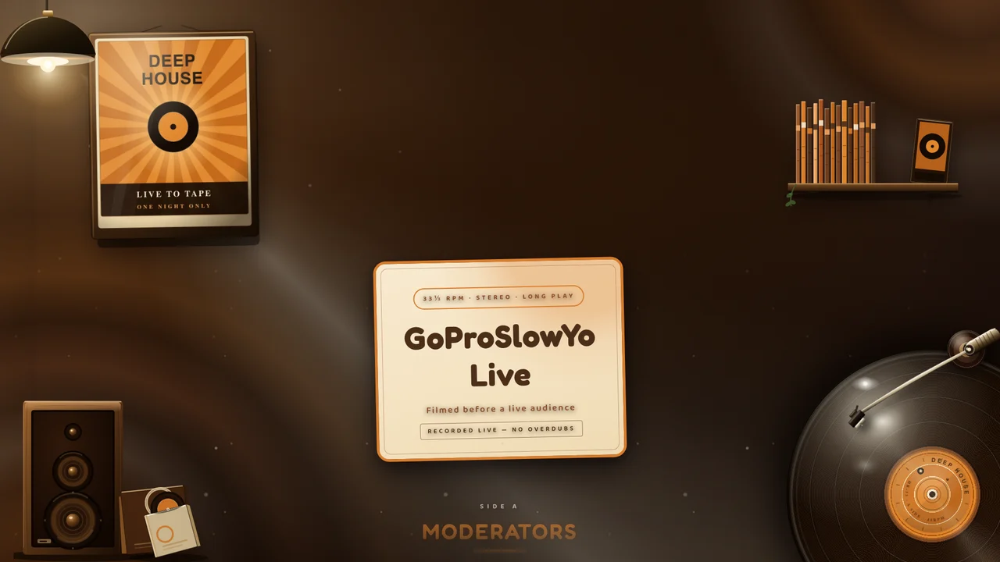</a> | **[Deep House (33⅓)](#deep-house)** MUSIC & DJ | A crate-digger's basement: a spinning corner turntable with a real pivoted tonearm, warm lamp light and dust, blocks as record SIDE A/B tracklists. |
| <a href="#junglist">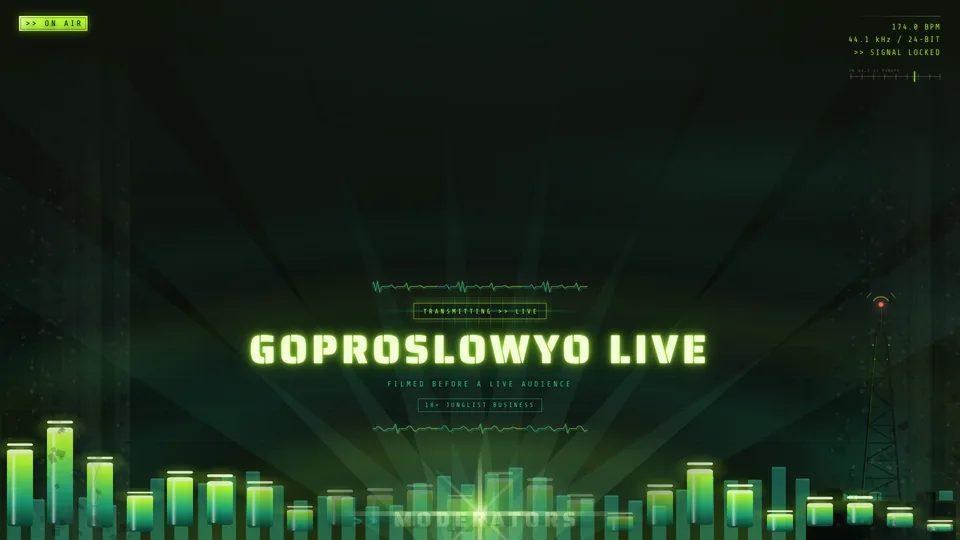</a> | **[Junglist](#junglist)** MUSIC & DJ | Acid-green pirate-radio signal: oscilloscope waveform dividers under stencil titles, a `174 BPM / SIGNAL LOCKED` HUD, a spectrum analyzer pumping like live audio, `>> ON AIR` chip. |
| <a href="#block-party">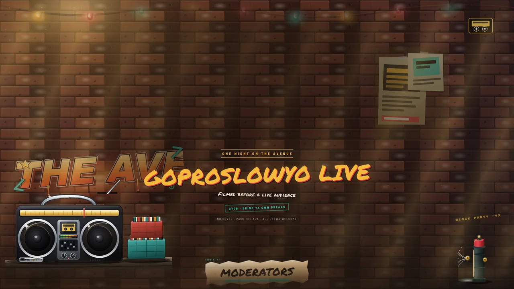</a> | **[Block Party](#block-party)** MUSIC & DJ | A 90s stoop jam: a detailed boombox against a graffiti wall — a `THE AVE` burner and a teal `FRESH` throwie with drips and overspray — a chunky fire hydrant, laced sneakers slung on the wire, string lights, cassette-tape dividers, `SOUND CLASH` finale. |
| <a href="#mainstage">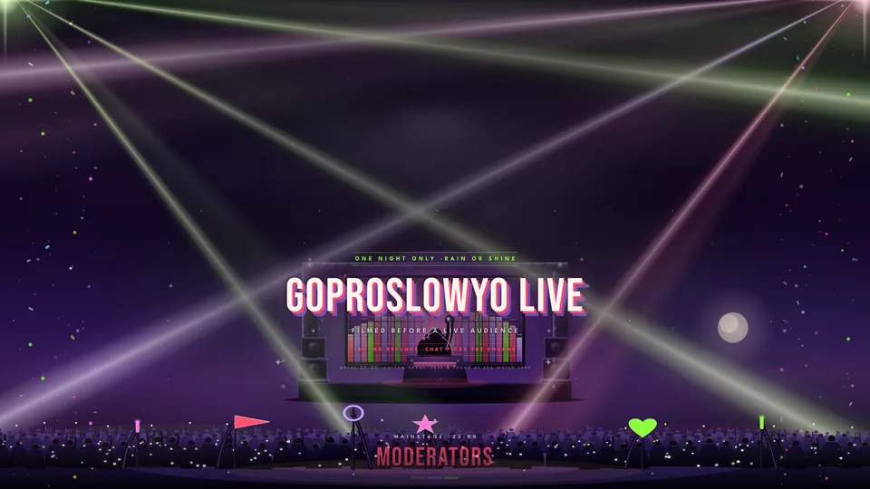</a> | **[Mainstage](#mainstage)** MUSIC & DJ | The credits as a festival poster: an LED-wall stage cycling CO2 jets and firework bursts, volumetric laser fans, a phone-lit crowd silhouette, smooth desynced confetti, stage-name sections, a headliner finale. |
| <a href="#sunrise-set">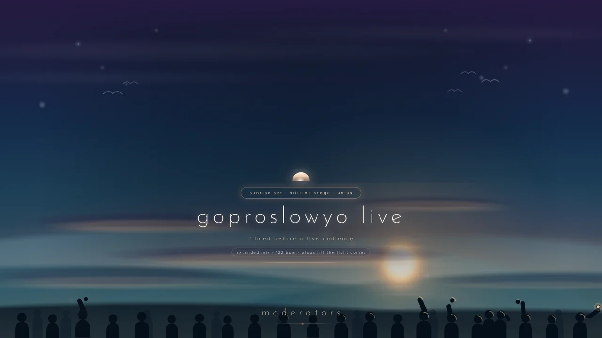</a> | **[Sunrise Set](#sunrise-set)** MUSIC & DJ | A 6am hillside set — a soft rising sun with god-rays, skeins of gulls gliding across a dawn-warmed sky, a crowd with raised hands and twinkling phone-lights, drifting lantern orbs, airy lowercase type. |
| <a href="#blue-note">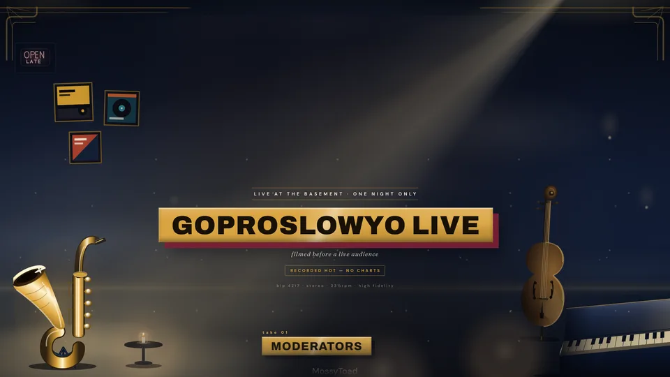</a> | **[Blue Note](#blue-note)** MUSIC & DJ | A smoky basement jazz club at last call — Reid-Miles color-block titles, a brass saxophone in a spotlight pool, a bassist in the shadows, drifting smoke. |
| <a href="#final-round">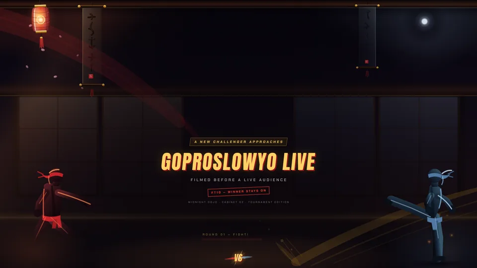</a> | **[Final Round](#final-round)** GAMING | Arcade fighting-game energy: two redrawn fighters — one in a forward guard, one throwing a high kick — trade blows with impact sparks in the gutters, ink brush-slash accents, roster rows with health bars, `ROUND N / FIGHT!` sections and a `K.O.!!` finale. |
| <a href="#victory-fanfare">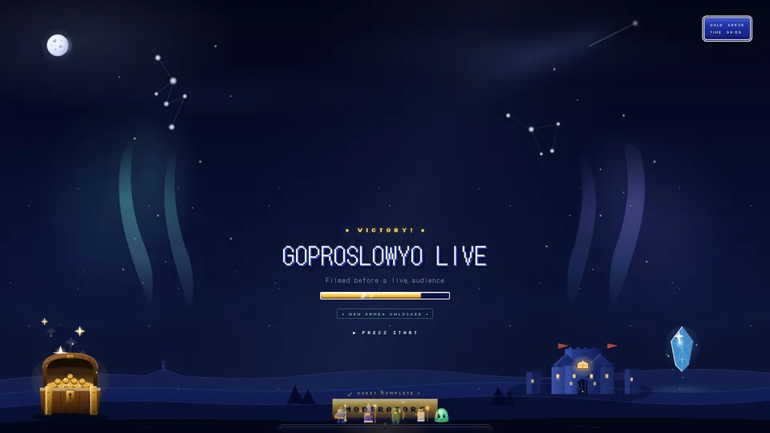</a> | **[Victory Fanfare](#victory-fanfare)** GAMING | A classic 16-bit JRPG menu: beveled blue window-skin panels, an adventuring party lined up below (knight, mage, ranger, cleric) with a hopping slime pet and campfire fireflies, a hand cursor on rows, `EXP +500` amounts, a `LEVEL UP!` finale. |
| <a href="#personal-best">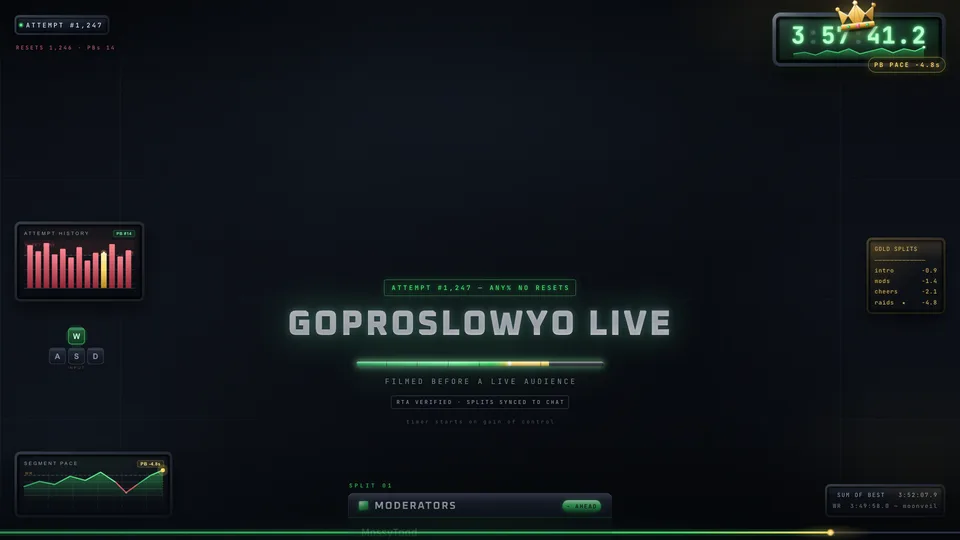</a> | **[Personal Best](#personal-best)** GAMING | A speedrunner's split timer: dark timer UI, blocks as split segments with green/gold/red deltas, a big monospace timer, a `WORLD RECORD` finale. |
| <a href="#blocklight">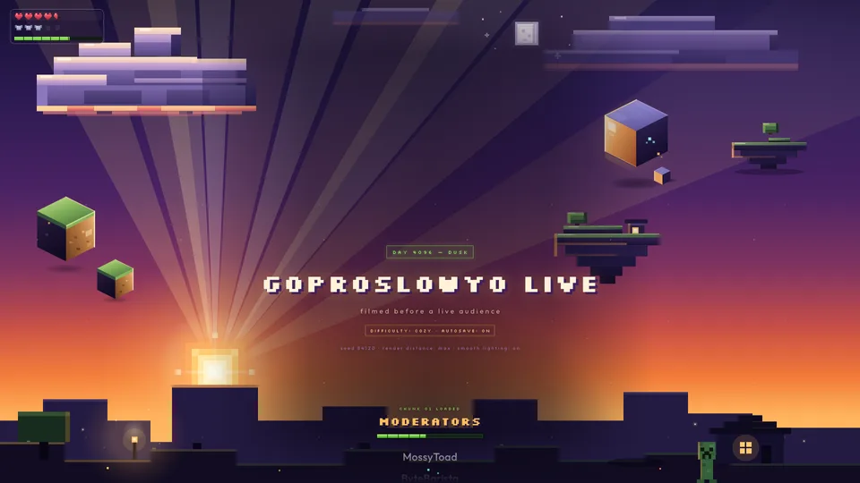</a> | **[Blocklight](#blocklight)** GAMING | A blocky-world dusk: big pixel clouds, floating light-catching cubes, a chunky terrain silhouette, an XP bar under titles, a heart/armor HUD, `x64`-style amounts. |
| <a href="#grand-finals">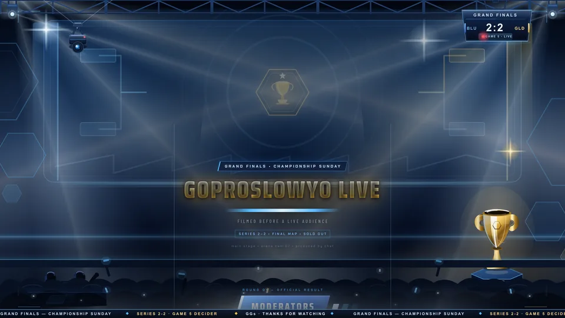</a> | **[Grand Finals](#grand-finals)** GAMING | An esports grand-final overlay: a championship-gold title, a jumbotron champion crest over a floodlit crowd firing camera flashes, a pulsing `LIVE` dot, glossy angular lower-thirds, team-tag rows and an `MVP` finale. |
| <a href="#chequered-flag">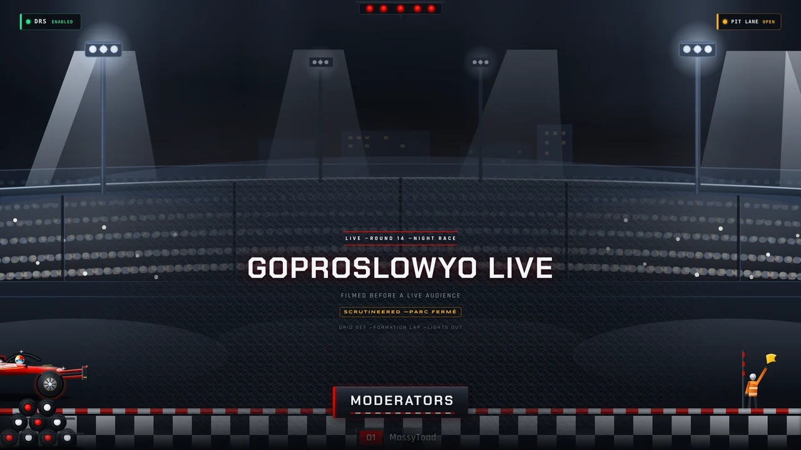</a> | **[Chequered Flag](#chequered-flag)** GAMING | A night-race world feed: a timing tower (position, name, gap), a floodlit grandstand, a marshal waving the chequered flag as a spin-blurred car streaks the pit straight, a second car on the far straight, `CHEQUERED FLAG — P1` finale. |
| <a href="#capture-the-flag">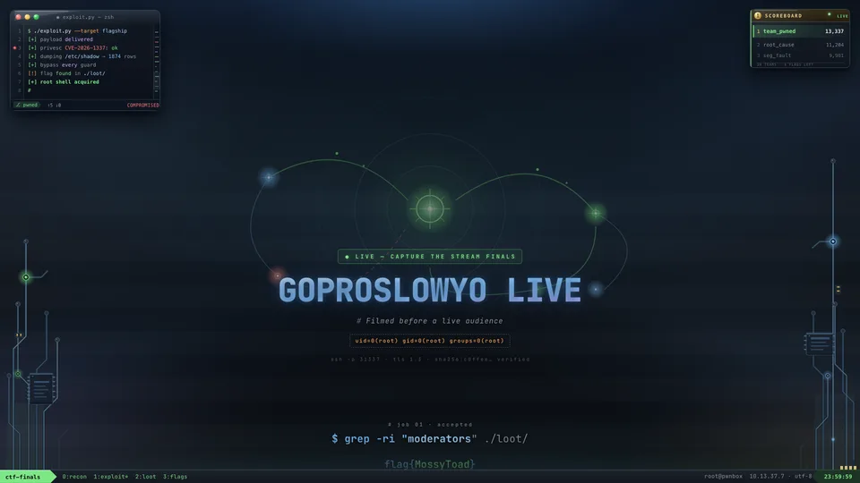</a> | **[Capture the Flag](#capture-the-flag)** CYBER & CTF | A hacker's IDE: syntax-highlighted terminal, every name wrapped as `flag{Username}`, section titles as shell commands, points like `[500 pts]`, a `root shell acquired` raid alert. |
| <a href="#netrunner">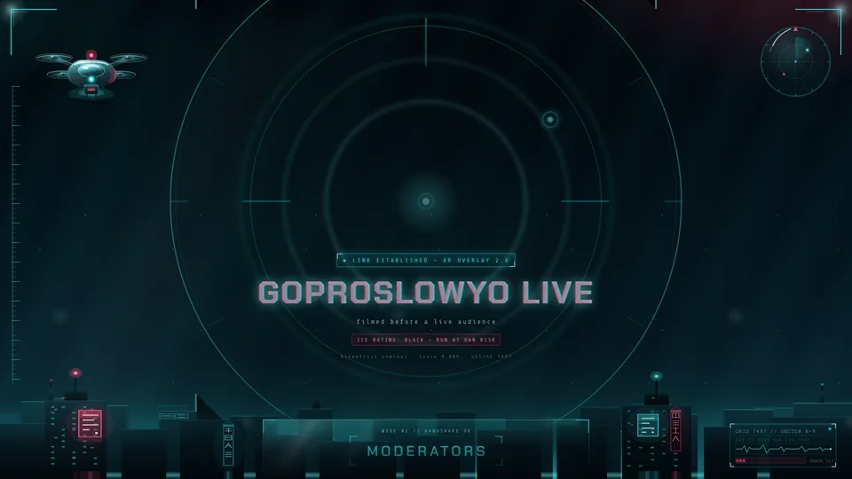</a> | **[Netrunner](#netrunner)** CYBER & CTF | A holographic AR HUD over a neon city: neon vertical signage and rain-slick street reflections behind glassmorphic panels, angular corner brackets, teal/magenta duotone, an oscilloscope data card, an `INTRUSION DETECTED` finale. |
| <a href="#digital-rain">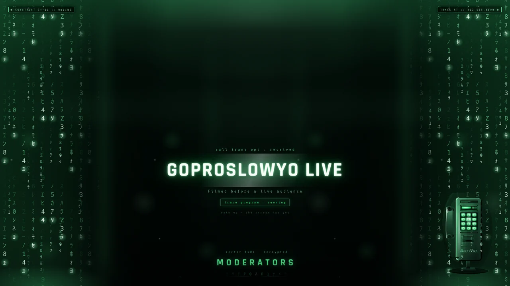</a> | **[Digital Rain](#digital-rain)** CYBER & CTF | The code-rain homage done cleanly — falling glyph columns kept in the side gutters with white-hot lead glyphs, crisp readable white names in the center, a `WAKE UP` flash. |
| <a href="#neo-noir">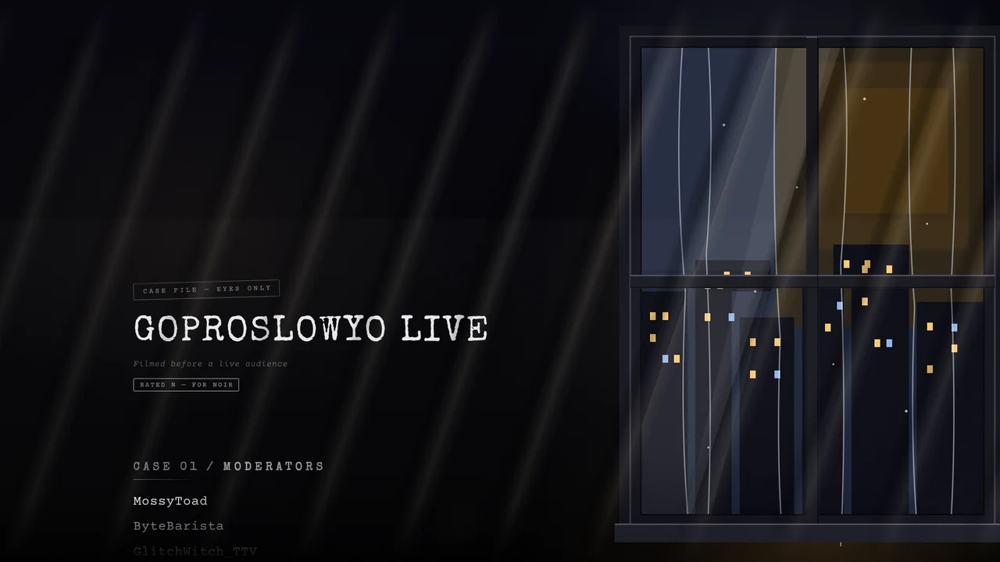</a> | **[Neo-Noir](#neo-noir)** NIGHT, SCENE & NOSTALGIA | Rain-slick monochrome — a detective's desk corner (rotary phone, case file, ashtray, amber glass) under a warm lamp, structured venetian light shafts, film grain, typewriter case-file rows, one red word for the raid, an ivory `THE CITY SLEEPS` outro. |
| <a href="#silver-nocturne">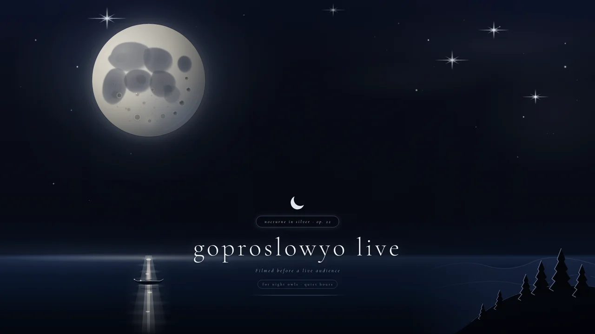</a> | **[Silver Nocturne](#silver-nocturne)** NIGHT, SCENE & NOSTALGIA | A cool moonlit nocturne — a redrawn cratered moon with a small companion crescent over a still sea, a shimmering moonglade, a drifting lantern boat, occasional shooting stars, thin elegant serif. |
| <a href="#aurora">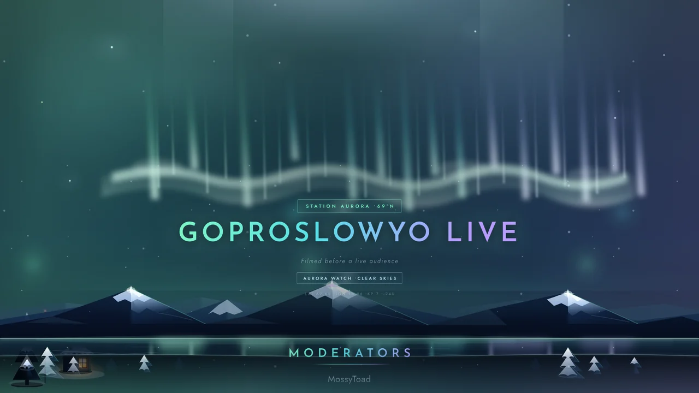</a> | **[Aurora](#aurora)** NIGHT, SCENE & NOSTALGIA | Vast layered aurora curtains — green, violet and magenta drapes with blazing hems — dance over a near-black snowy ridge, where a lone silhouetted witness and their dog sit by a glowing tent and campfire; meteors streak the `UNDER THE LIGHTS · 69°N` sky. |
| <a href="#the-abyss">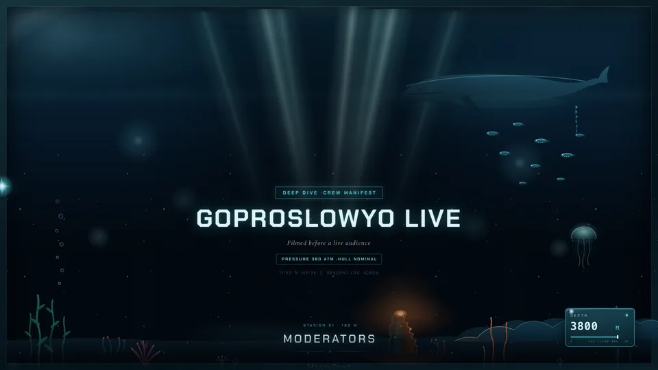</a> | **[The Abyss](#the-abyss)** NIGHT, SCENE & NOSTALGIA | A submarine descent into crushing dark: fading god-rays, drifting plankton, a passing whale, jellyfish and darting school, glowing vents, an anglerfish making one brief early pass, a depth-gauge HUD, a `LEVIATHAN SIGHTED` finale. |
| <a href="#close-encounter">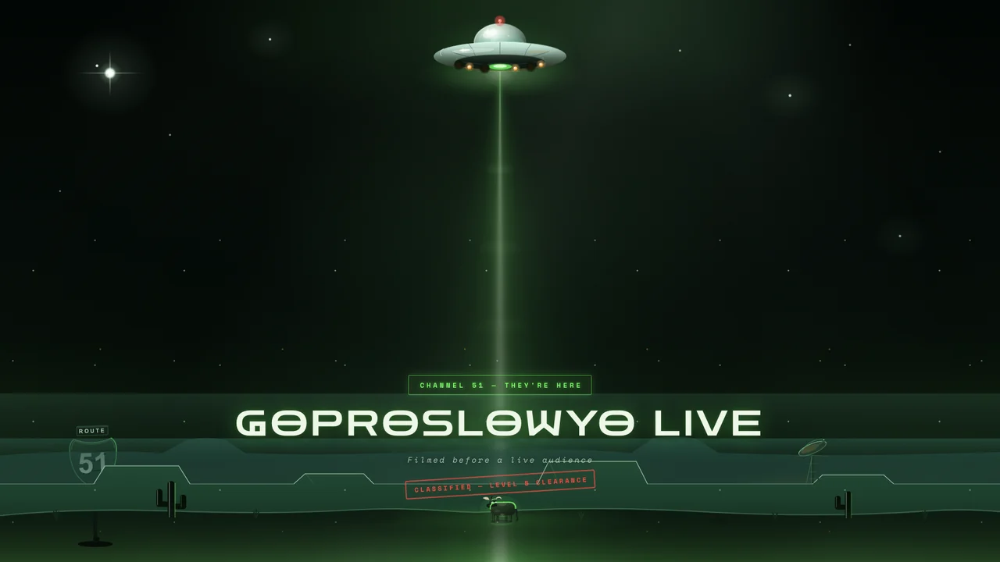</a> | **[Close Encounter](#close-encounter)** NIGHT, SCENE & NOSTALGIA | A 1950s drive-in flying saucer over a desert night — a chrome saucer with porthole lights, a green abduction beam, a `ROUTE 51` shield standing before the hills, and a cow that gets taken every 18 seconds. |
| <a href="#lo-fi-room">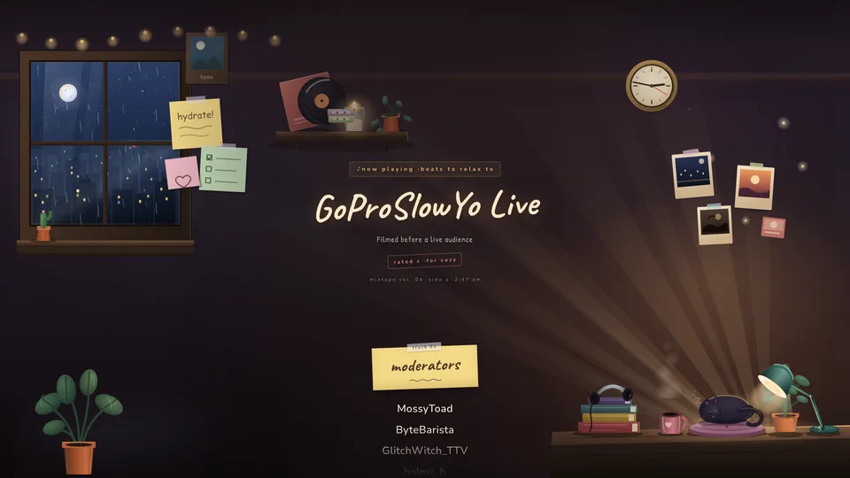</a> | **[Lo-Fi Room](#lo-fi-room)** NIGHT, SCENE & NOSTALGIA | A cozy study room — warm desk-lamp glow, a rainy night window, books, a mug, a sleeping cat, handwritten titles and sticky notes. |
| <a href="#blue-plate-diner">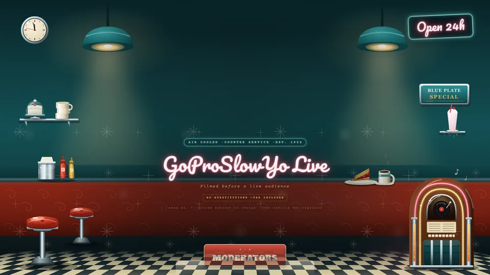</a> | **[Blue Plate Diner](#blue-plate-diner)** NIGHT, SCENE & NOSTALGIA | The credits as a 50s diner menu: chrome and red vinyl, an `OPEN 24H` neon sign, a tall jukebox and counter stools, menu rows with dot-leaders to prices (bits as cents!), counter-scale pie-and-coffee. |
| <a href="#end-of-broadcast">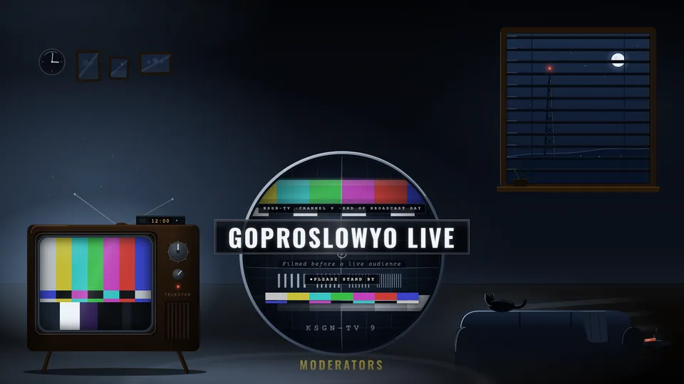</a> | **[End of Broadcast](#end-of-broadcast)** NIGHT, SCENE & NOSTALGIA | A dark living room at 3 a.m. lit only by a walnut console TV — rabbit ears, SMPTE bars cycling through `PLEASE STAND BY` to rolling static — a sleeping cat on the couch, venetian blinds framing the moon and a blinking transmitter tower, an `END OF TRANSMISSION` collapse-to-a-dot outro. |
| <a href="#corkboard">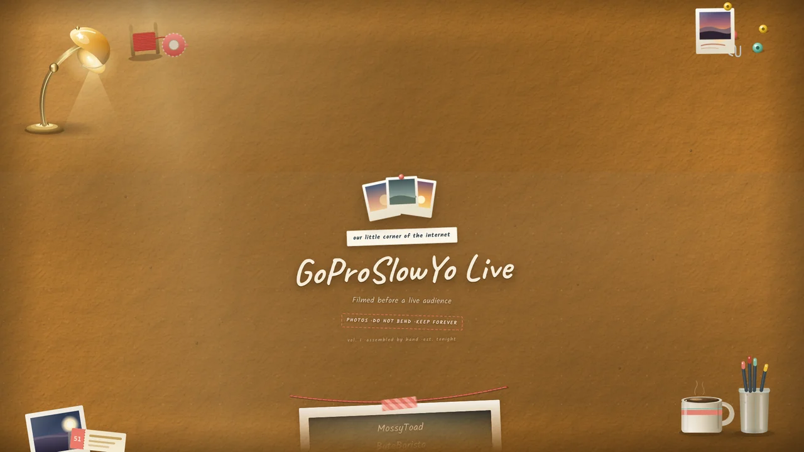</a> | **[Corkboard](#corkboard)** NIGHT, SCENE & NOSTALGIA | The memory wall at 1 a.m.: a dusk-plum bedroom wall of pinned polaroids under twinkling fairy-light swags, neon marker doodles (`best stream ever!!`, `gg!`), red threads meeting a `THANK YOU!` card, names on lit-wire polaroid cards, a gold-star finale. |
| <a href="#the-crew">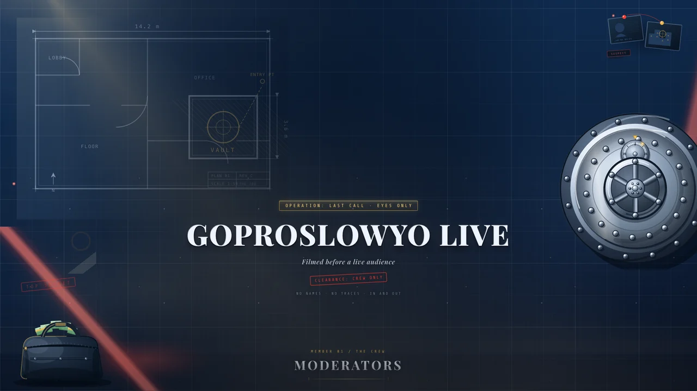</a> | **[The Crew](#the-crew)** NIGHT, SCENE & NOSTALGIA | The end-credits as a heist crew reveal: a flashlight cone panning a navy blueprint, a brushed-steel vault with a clicking dial and gold gleam, red laser tripwires, roles as section eyebrows, cuts of the take as amounts, a `THE SCORE` finale. |

---

## Cinematic & classic

### Classic Film
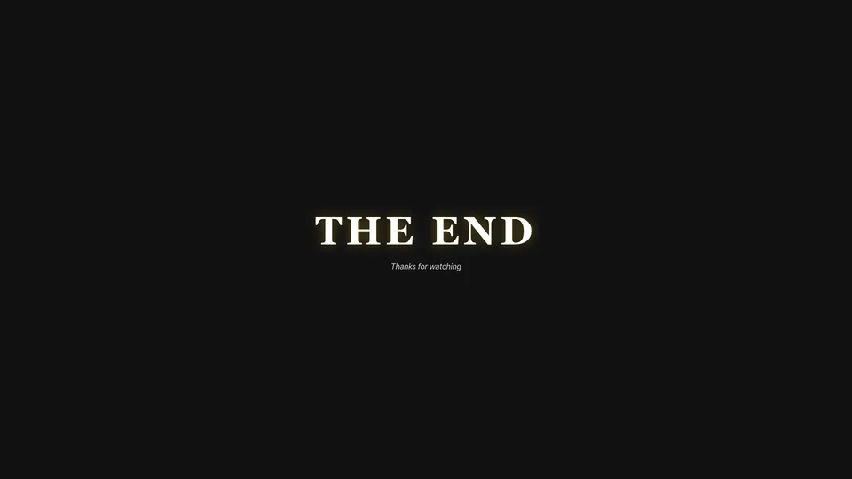

The default: a warm gold-on-black movie crawl with a Playfair serif, glowing section titles, and film-style intro/outro flourish cards. Understated and universal.
*Palette: black + film-gold · Serif display · "The End" outro.*

### Space Crawl
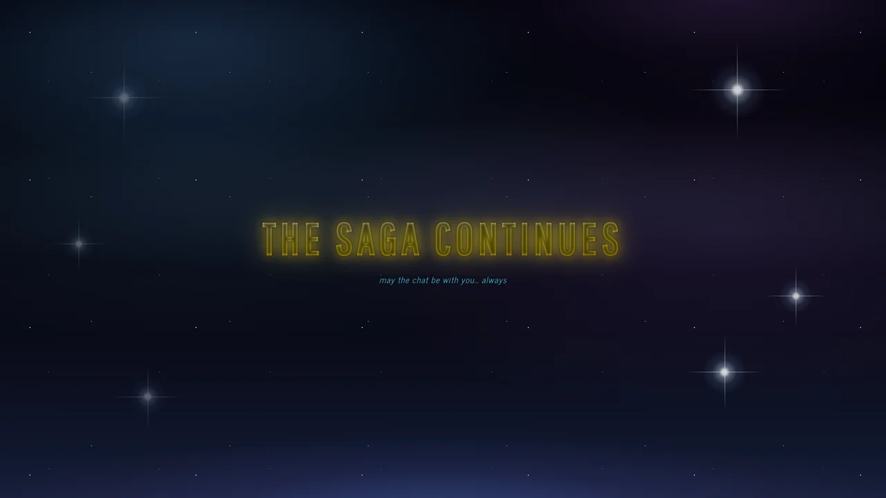

The space-opera homage — golden text recedes up a steeply tilted plane, converging to a true vanishing-point apex, into a deep starfield toward a glowing galactic core. The only theme that changes the physics of the crawl.
*Palette: #FFE81F on deep space · News Gothic · 3D perspective tilt (`--space-crawl-tilt` knob).*

### Mission Control
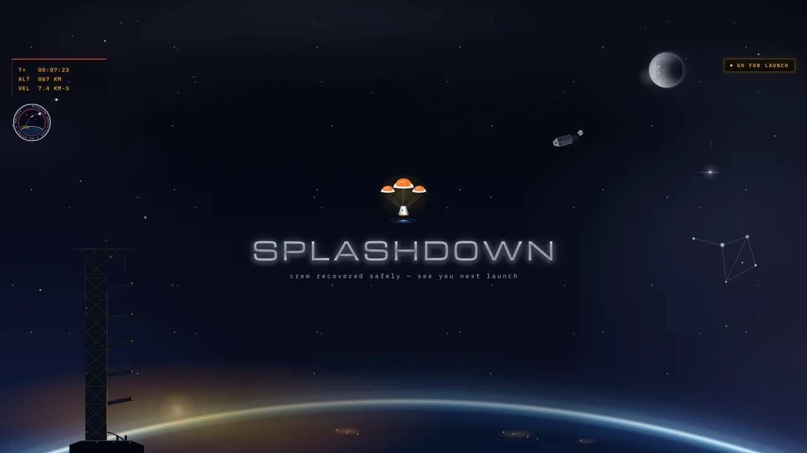

Apollo-era launch: a Saturn V climbs the left third on a flame, live telemetry (`T+ / ALT / VEL`) in the corner, an Earth-limb sunrise across the bottom. Sections are mission stages.
*Palette: deep-space blue + NASA red + amber · Michroma / IBM Plex Mono · ascending rocket.*

### Broadway Playbill
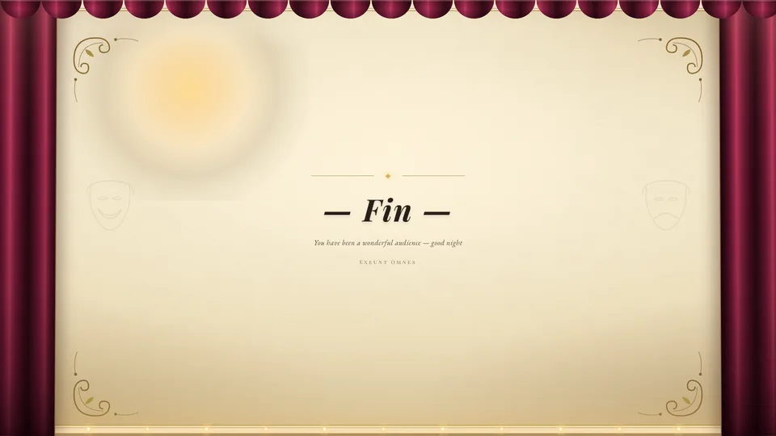

An engraved theatre programme on aged, gold-stamped cream stock, framed by rich velvet legs and a valance — the one light theme. A roving follow-spot sweeps the page, footlights twinkle in a chase, cast-list rows run dotted leaders under small-caps headers.
*Palette: cream paper + crimson + gilt + velvet · Playfair / EB Garamond · dot-leader cast list.*

### Quest Log
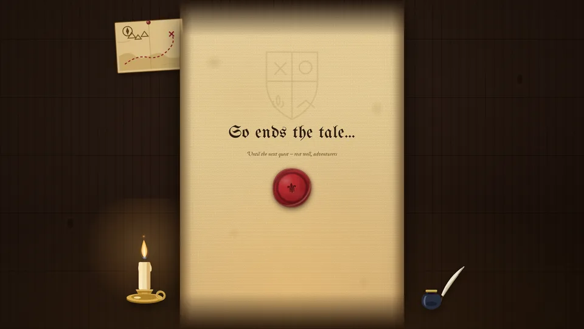

A candlelit tavern ledger on night-stained parchment — a flickering candle flame (the scribe's light) throws drifting embers over blackletter quest headings led by an illuminated drop-cap, ruled sign-in rows with "× N" tallies, a wax-seal outro.
*Palette: night-tavern leather + parchment + wax red · blackletter · ruled ledger rows.*

## Retro, synth & terminal

### Neon Night Drive
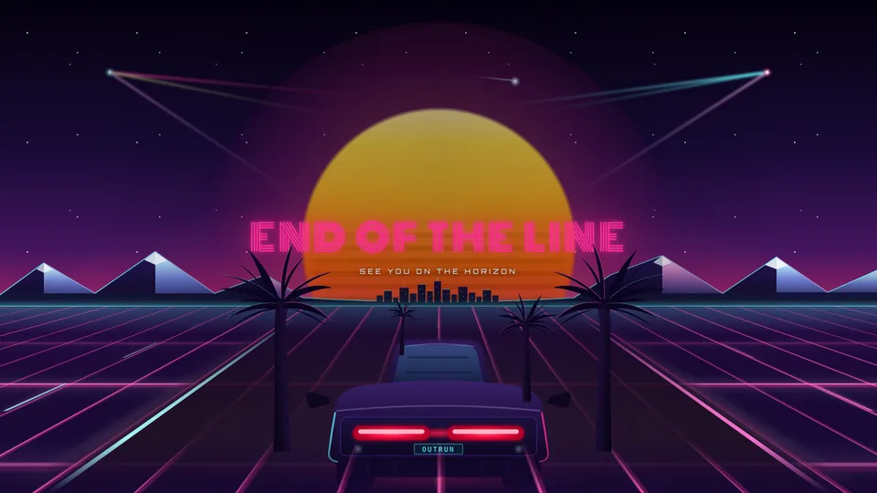

A full OutRun scene: a striped sun (with rolling blinds) as the rearmost backdrop, city and mountain silhouettes, and a hero coupe driving toward the vanishing point above a neon road grid, palms rushing past on either side. Two 3-beam lasers scissor on independent periods, cycling magenta and cyan; a high-score-style roster and a neon-tube outro.
*Palette: indigo night + magenta/cyan neon + gold sun · Audiowide/Orbitron · driving coupe + grid + lasers.*

### VHS Home Video
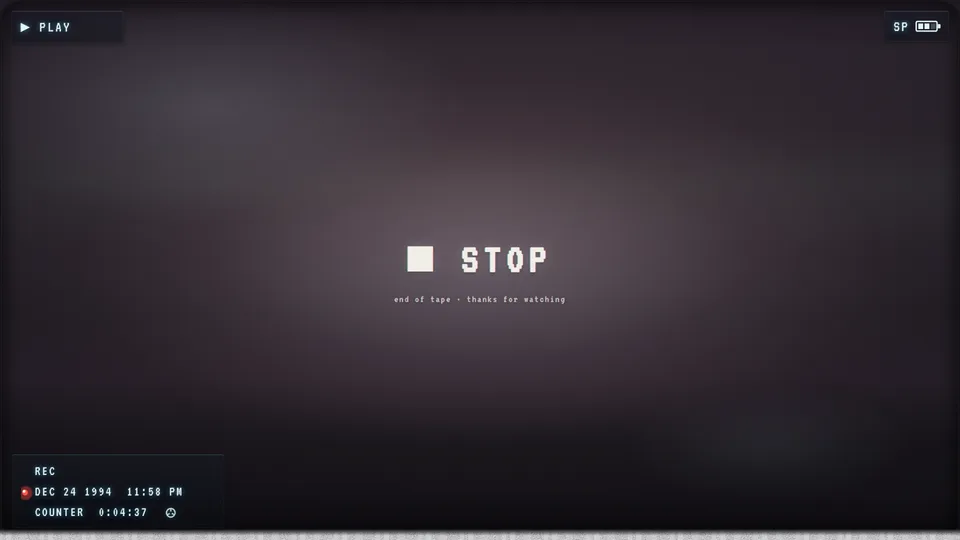

A taped-off-air family recording — soft white text with chromatic fringing, VCR OSD chrome (`▶ PLAY`, blinking `● REC`, a 1994 timestamp), a periodic tracking-glitch band.
*Palette: warm tape blacks + red REC · VT323 · camcorder OSD + tracking glitch.*

### Phosphor Terminal
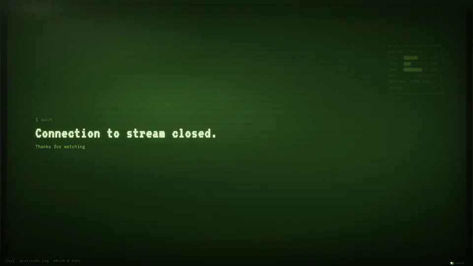

A hacker's CRT tty: green-phosphor monospace transcript, `$ cat subscribers.log` section commands, `cat -n` line numbers, scanlines, an amber `tail -f raids.log` finale.
*Palette: phosphor green on black · IBM Plex Mono / VT323 · terminal transcript.*

### Arcade High Score
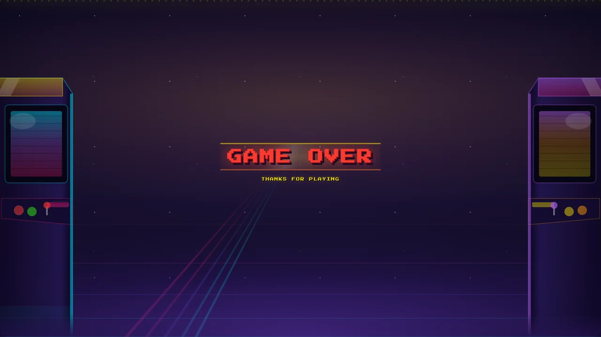

An arcade in attract mode: the left flanking cabinet plays a Space-Invaders attract demo, a rank of distant cabinets lines the back wall over a neon floor fan. Press Start 2P pixel font, ranked `HIGH SCORES` panels with dot leaders and `PTS`, per-section hue cycling, a blinking `INSERT COIN` badge and a `GAME OVER` outro.
*Palette: neon-on-purple + scanlines · Press Start 2P · high-score panels.*

### Dot Matrix
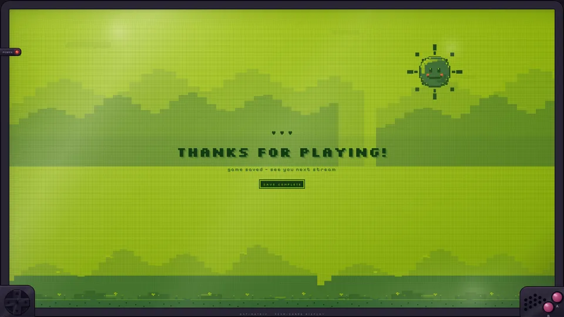

The 4-shade olive-green handheld LCD — chunky pixel font, a faint dot-grid over the roll, a molded console bezel with A/B buttons, `THANKS FOR PLAYING!` outro.
*Palette: 4-shade LCD green · pixel font · handheld bezel.*

## Music & DJ

### Roller Disco
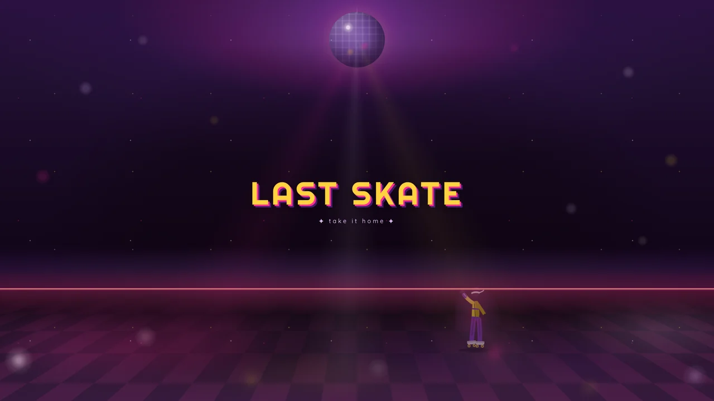

A full rink under a mirror ball — an ensemble of **seven** hand-drawn skaters strides, weaves, high-fives and near-misses across a 2.5D checkered floor, sparkle bursts and all.
*Palette: hot pink + gold + purple glam · Righteous · choreographed skating ensemble.*

### On Deck
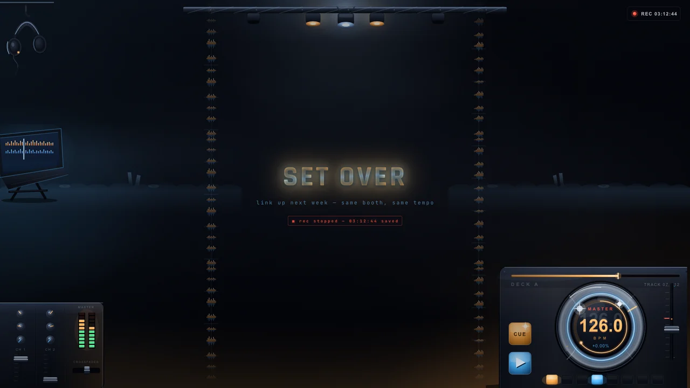

A club DJ booth close-up: a photoreal CDJ jog wheel with a lit `126.0 BPM` display, a mixer strip with VU meters, waveform ribbons, `DECK A / DECK B` sections, tracks tagged with key + BPM.
*Palette: amber/blue LEDs on near-black · condensed sans · jog-wheel hero.*

### Warehouse Rave
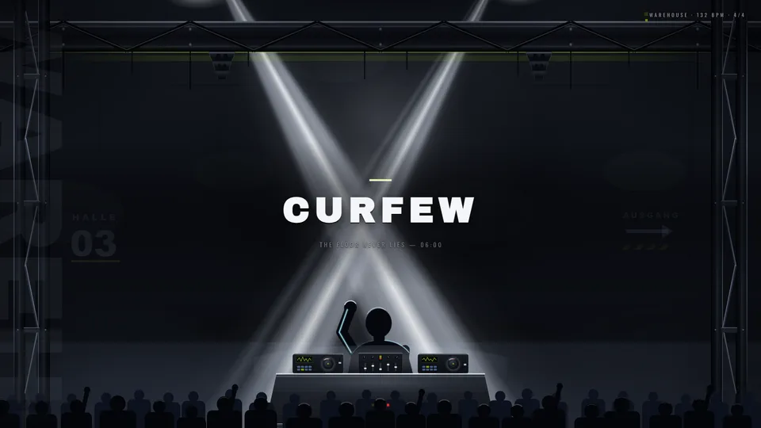

A Berlin-industrial concrete room: monolithic white type under volumetric beam shafts full of dust, a rim-lit DJ booth, catwalk and PA stacks, a 132-BPM beat dot, a curfew outro.
*Palette: cold concrete + acid green + red · Archivo Black · volumetric warehouse.*

### Deep House
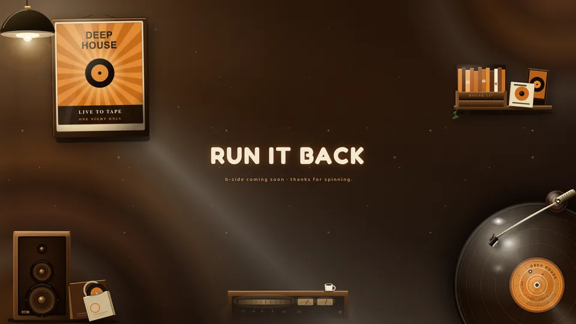

A crate-digger's basement: a spinning corner turntable with a real pivoted tonearm, warm lamp light and dust, blocks as record SIDE A/B tracklists.
*Palette: cream + burnt orange + chocolate · Fredoka / Baloo · turntable + tracklist.*

### Junglist
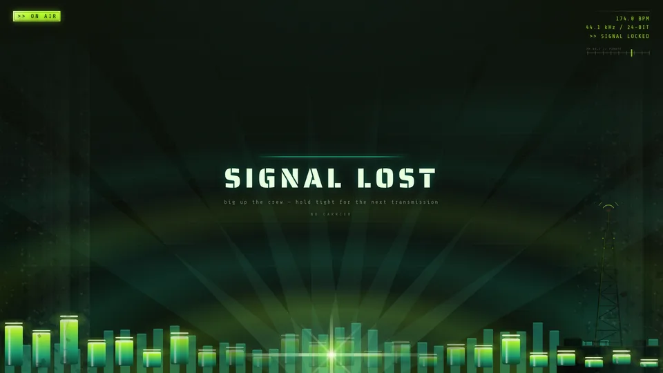

Acid-green pirate-radio signal: oscilloscope waveform dividers under stencil titles, a `174 BPM / SIGNAL LOCKED` HUD, a spectrum analyzer that pumps like live audio (interleaved bar groups running at different rhythms), a `>> ON AIR` chip.
*Palette: acid green + teal on black-green · Chakra Petch · waveform dividers.*

### Block Party
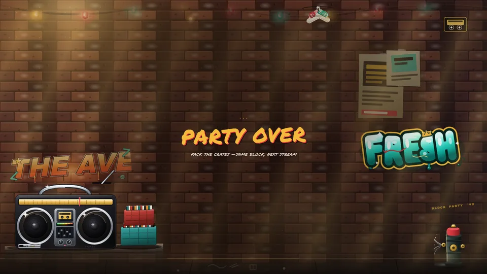

A 90s stoop jam: a detailed boombox in front of a graffiti wall — a leaning `THE AVE` burner on the left, a teal `FRESH` throwie on the right, both dripping with overspray. A chunky fire hydrant, laced sneakers slung over the wire, brick and string lights, cassette-tape dividers, a `SOUND CLASH` finale.
*Palette: brick + marker black/red + teal `FRESH` · spray-paint display · graffiti wall + boombox.*

### Mainstage
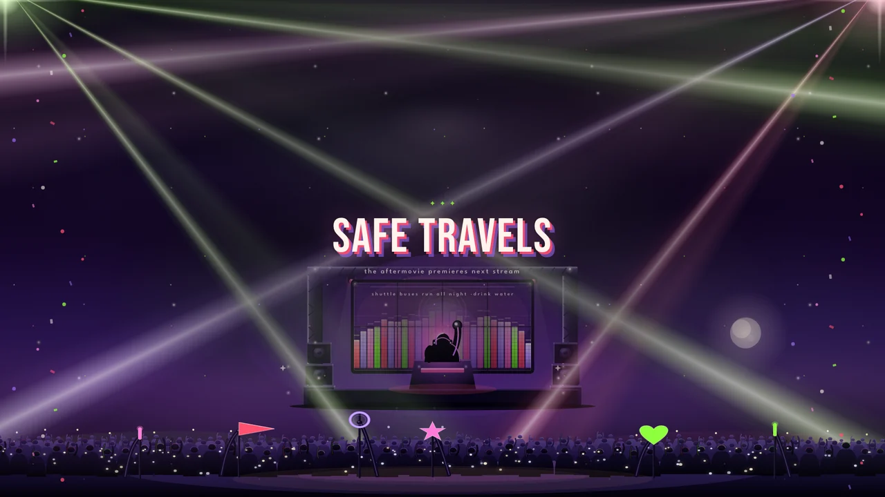

The credits as a festival poster: an LED-wall stage with CO2 jets and firework bursts cycling on the beat, volumetric laser fans, a phone-lit crowd silhouette, smooth desynced confetti falling, stage-name sections, a headliner finale.
*Palette: night + coral/violet/laser-green · poster display · festival stage.*

### Sunrise Set
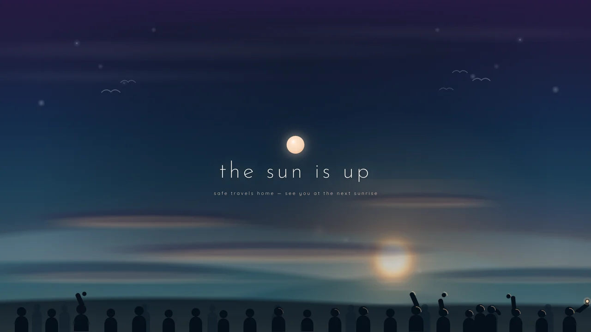

A 6am hillside set — a soft rising sun with god-rays over a dawn-warmed sky, skeins of gulls gliding past, a crowd with raised hands and twinkling phone-lights, dawn shimmer on the haze, drifting lantern orbs, airy lowercase type. The calm one.
*Palette: indigo-teal dawn → peach · Josefin Sans / Quicksand · sunrise + crowd.*

### Blue Note
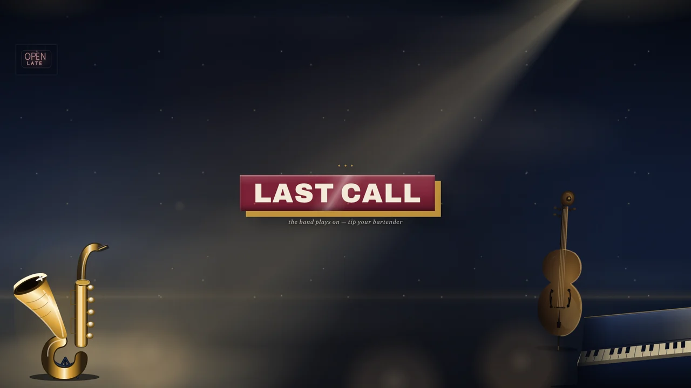

A smoky basement jazz club at last call — Reid-Miles color-block titles, a brass saxophone in a spotlight pool, a bassist in the shadows, drifting smoke.
*Palette: midnight blue + brass + bordeaux · Archivo / Fraunces italic · Blue-Note album styling.*

## Gaming

### Final Round
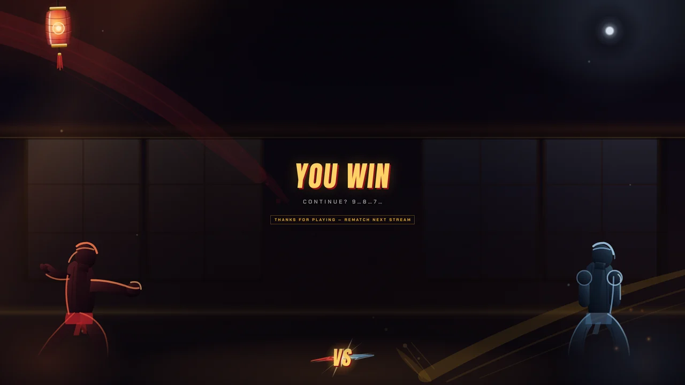

Arcade fighting-game energy: two redrawn fighters — a forward guard versus a high kick — trade periodic blows, impact sparks bursting in the gutters. Ink brush-slash accents, roster rows with health bars, `ROUND N / FIGHT!` sections and a `K.O.!!` finale.
*Palette: dojo night + red/gold · heavy slanted display · VS energy.*

### Victory Fanfare
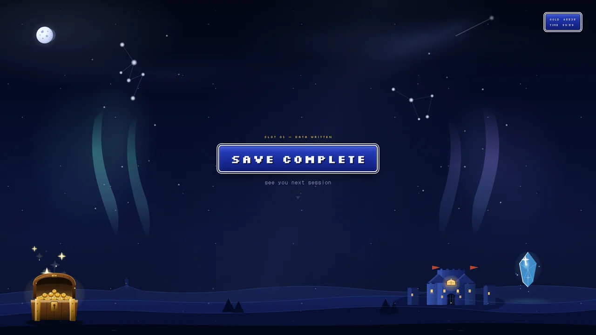

A classic 16-bit JRPG menu: beveled blue window-skin panels with double borders, a spaced adventuring party lined up beneath — knight, mage, ranger, cleric — with a hopping slime pet and campfire fireflies. A hand cursor on rows, `EXP +500` amounts, quest-complete banners, a `LEVEL UP!` finale.
*Palette: gradient menu-blue + white · bitmap-style menu font · RPG window boxes.*

### Personal Best
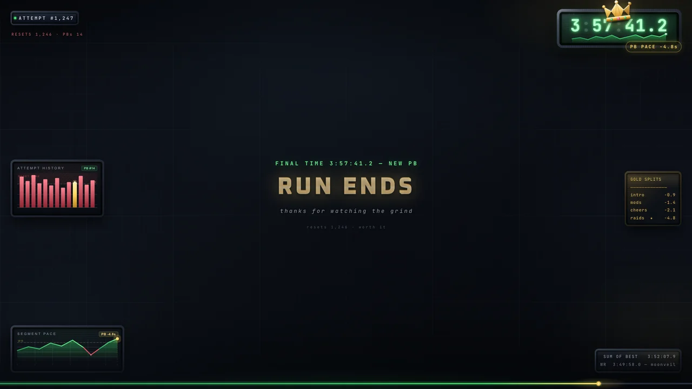

A speedrunner's split timer: dark timer UI, blocks as split segments with green/gold/red deltas, a big monospace timer, a `WORLD RECORD` finale.
*Palette: dark UI + delta green/gold/red · monospace · LiveSplit-style rows.*

### Blocklight
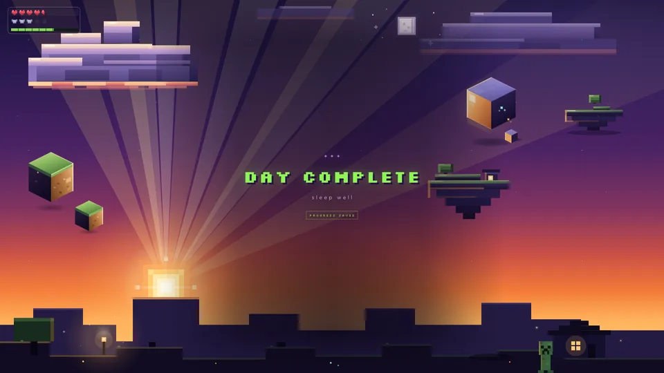

A blocky-world dusk: big pixel clouds, floating light-catching cubes, a chunky terrain silhouette, an XP bar under titles, a heart/armor HUD, `x64`-style amounts.
*Palette: voxel-sunset violet→amber · clean sans · floating cubes.*

### Grand Finals
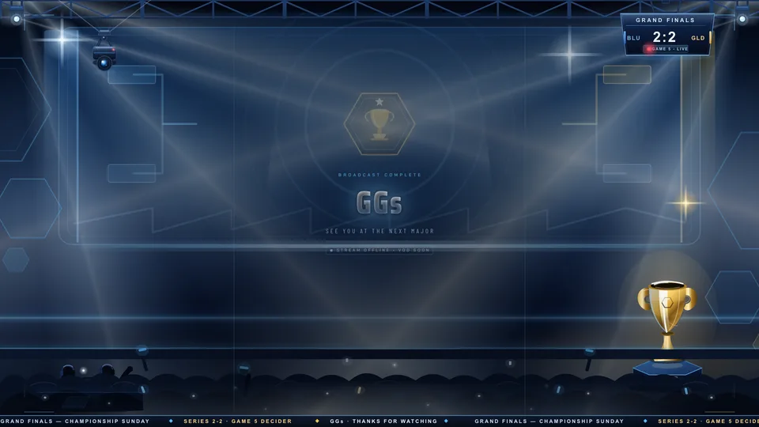

An esports broadcast overlay: a championship-gold title, glossy angular lower-thirds, a jumbotron champion crest above a floodlit arena crowd popping camera flashes, a pulsing `LIVE` dot, hex accents, a scoreline, team-tag rows and an `MVP` finale.
*Palette: navy + electric blue/white + gold · condensed sans · broadcast package.*

### Chequered Flag
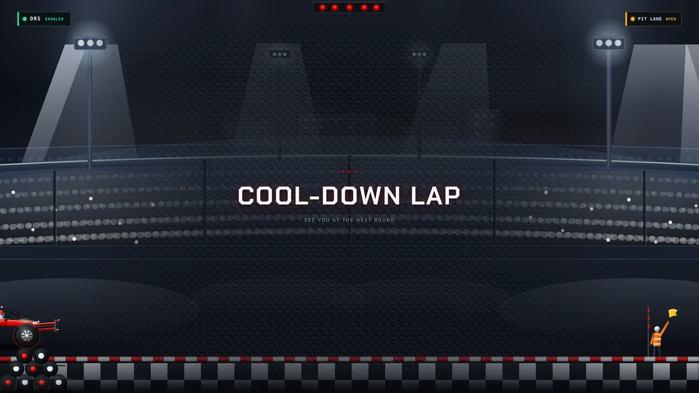

A night-race world feed: a timing tower (position, name, gap), a floodlit grandstand crowd, and a marshal waving a black-and-white chequered flag as an F1 car streaks the pit straight — wheels spin-blurred, speed streaks trailing — while a second car runs the far straight. A chequered-flag band and a `CHEQUERED FLAG — P1` finale.
*Palette: racing red + amber + gold + carbon · Chakra Petch · timing tower.*

## Cyber & CTF

### Capture the Flag
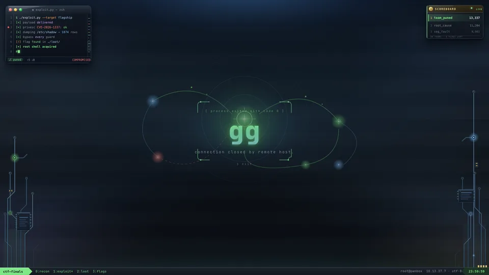

A hacker's IDE: syntax-highlighted terminal, every name wrapped as `flag{Username}`, section titles as shell commands, points like `[500 pts]`, a `root shell acquired` raid alert.
*Palette: dark IDE + syntax colors · monospace · flag{} rows.*

### Netrunner
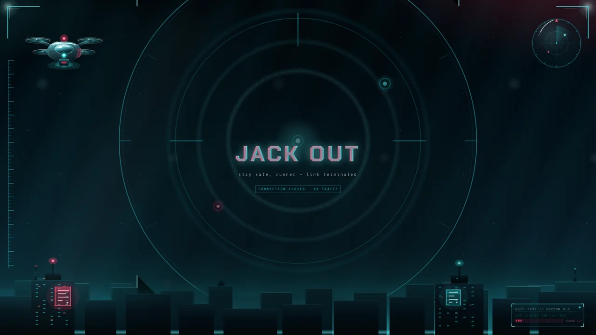

A holographic AR HUD over a neon city: glassmorphic panels and angular corner brackets float over neon vertical signage and rain-slick street reflections, teal/magenta duotone, monospace stat chips, an oscilloscope data card, an `INTRUSION DETECTED` finale.
*Palette: teal + magenta on near-black · techy sans · holo-glass panels.*

### Digital Rain
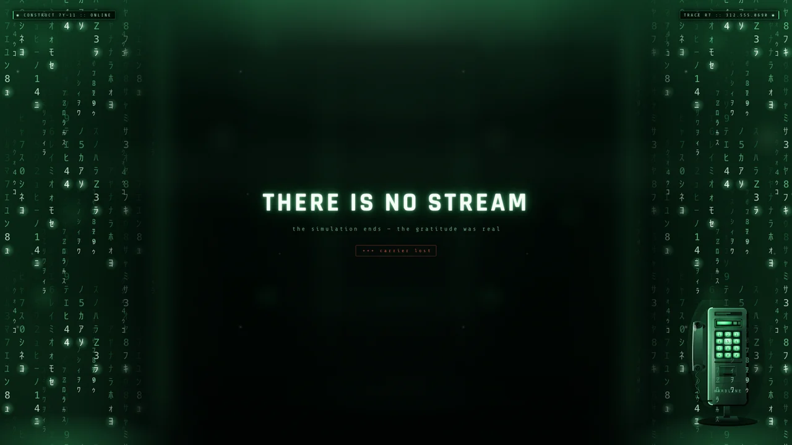

The code-rain homage done cleanly — falling glyph columns kept in the side gutters with white-hot lead glyphs, crisp readable white names in the center, a `WAKE UP` flash.
*Palette: phosphor green + white-hot · monospace · gutter glyph rain.*

## Night, scene & nostalgia

### Neo-Noir
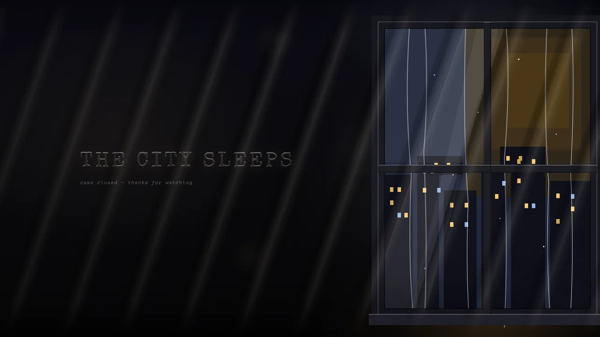

Rain-slick monochrome: a detective's desk-corner vignette — rotary phone, case file, ashtray, amber glass — pooled under a warm lamp, structured venetian light shafts and film grain over typewriter case-file rows. Exactly one red word, saved for the raid finale; a solid ivory `THE CITY SLEEPS` outro.
*Palette: black + silver + one red · Special Elite / Courier Prime · desk vignette + blinds.*

### Silver Nocturne
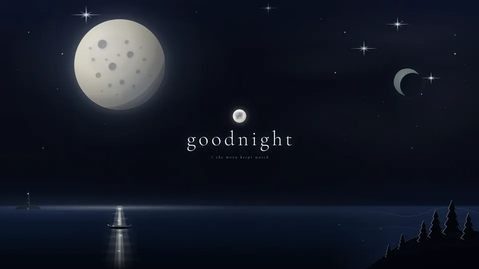

A cool moonlit nocturne — a redrawn cratered moon with a small companion crescent above a still sea, a shimmering moonglade, drifting clouds, and a lone lantern boat. Occasional shooting stars, thin elegant serif, moon-phase ornaments. Near-stillness.
*Palette: ink navy + moon silver · Cormorant Garamond · cratered moon + moonglade.*

### Aurora
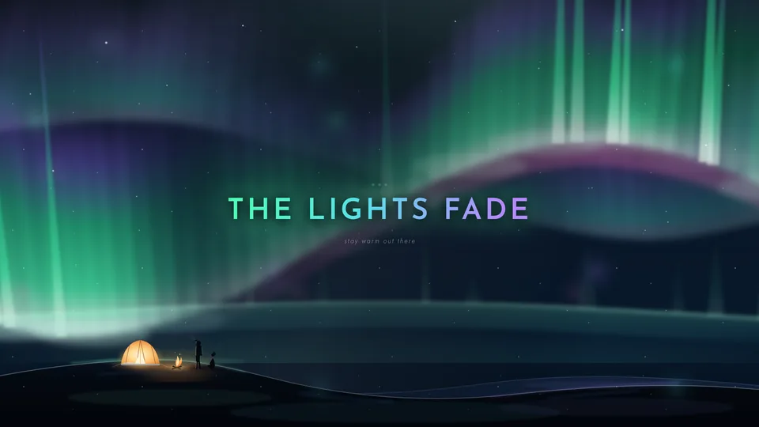

Vast layered aurora curtains — folded green, violet and magenta drapes with blazing hems — dance on independent periods over a near-black snowy ridge. A tiny silhouetted witness and their dog sit beside a glowing tent and a flickering campfire, the only warm light in the scene; meteors streak past under an `UNDER THE LIGHTS · 69°N` fiction.
*Palette: near-black night + green/violet/magenta aurora + campfire amber · thin sans · layered curtains.*

### The Abyss
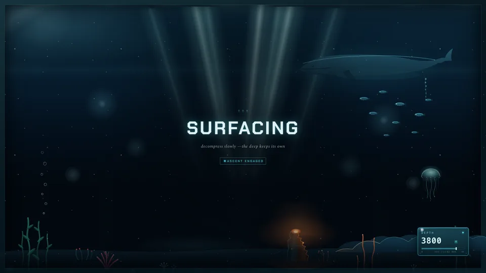

A submarine descent into crushing dark: fading god-rays and drifting bioluminescent plankton up top, a passing whale, a pulsing jellyfish, a darting school and glowing hydrothermal vents below. An anglerfish cruises one smooth pass early in each loop (mostly off-screen), a depth-gauge HUD ticks down, a `LEVIATHAN SIGHTED` finale.
*Palette: near-black blue + cyan glow · cool sans · deep-sea life + anglerfish.*

### Close Encounter
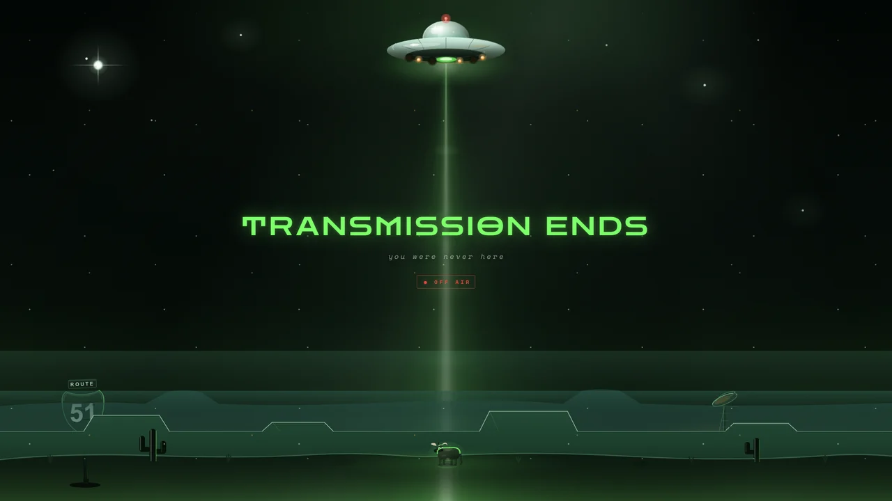

A 1950s drive-in flying saucer over a desert night — a chrome saucer with porthole lights, a green abduction beam, a `ROUTE 51` shield standing clearly in front of the hills, and a cow that gets taken every 18 seconds.
*Palette: green-black night + amber + chrome · Zen Dots · saucer + beam + cow.*

### Lo-Fi Room
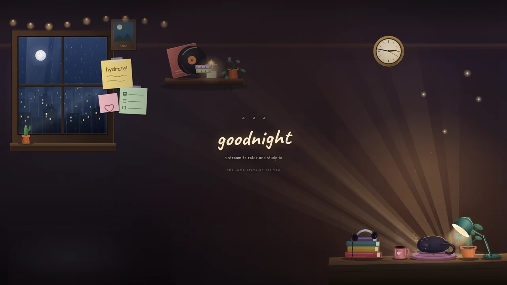

A cozy study room — warm desk-lamp glow, a rainy night window, books, a mug, a sleeping cat, handwritten titles and sticky notes. Beats to relax to.
*Palette: warm room browns + lamp glow · Caveat / soft sans · desk scene + cat.*

### Blue Plate Diner
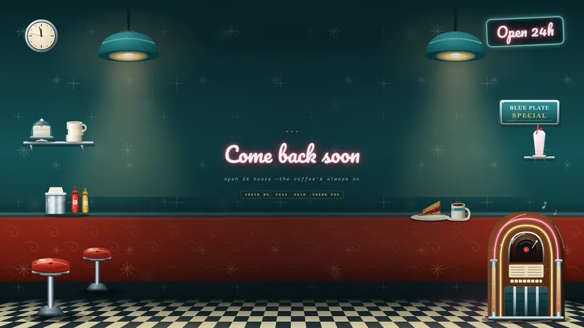

The credits as a 50s diner menu: chrome and red vinyl, an `OPEN 24H` neon sign, a tall jukebox and counter-height stools framing the room, menu rows with dot-leaders to prices (bits as cents!), counter-scale pie-and-coffee illustrations.
*Palette: cream + red vinyl + chrome + teal · script neon · diner menu.*

### End of Broadcast
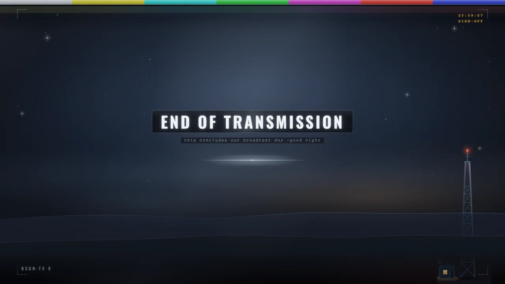

A dark living room at 3 a.m., lit only by a walnut console TV — rabbit ears up, its glow re-lighting the room as it cycles SMPTE bars → `PLEASE STAND BY` → rolling static. A cat sleeps on the couch; venetian blinds frame the moon and a red-blinking transmitter tower outside. A `KSGN-TV 9` test-card intro, a `SPECIAL BULLETIN` raid block, an `END OF TRANSMISSION` collapse-to-a-dot outro.
*Palette: 3 a.m. living-room dark + phosphor TV glow · caption sans · console TV + collapse-to-dot.*

### Corkboard
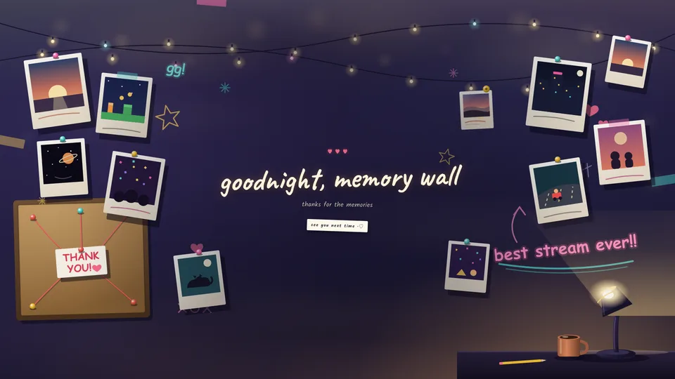

The memory wall, 1 a.m. — a dusk-plum bedroom wall covered in colorful pinned polaroids of stream memories, twinkling fairy-light swags going soft-bokeh, neon marker doodles (`best stream ever!!`, `gg!`), and a corkboard patch where red threads meet a `THANK YOU!` card, all under a warm desk-lamp pool. Names ride polaroid cards strung on a lit wire, with an occasional new-photo drop-in.
*Palette: dusk-plum wall + polaroid white + fairy-light glow · Caveat / Kalam · pinned photos + red threads.*

### The Crew
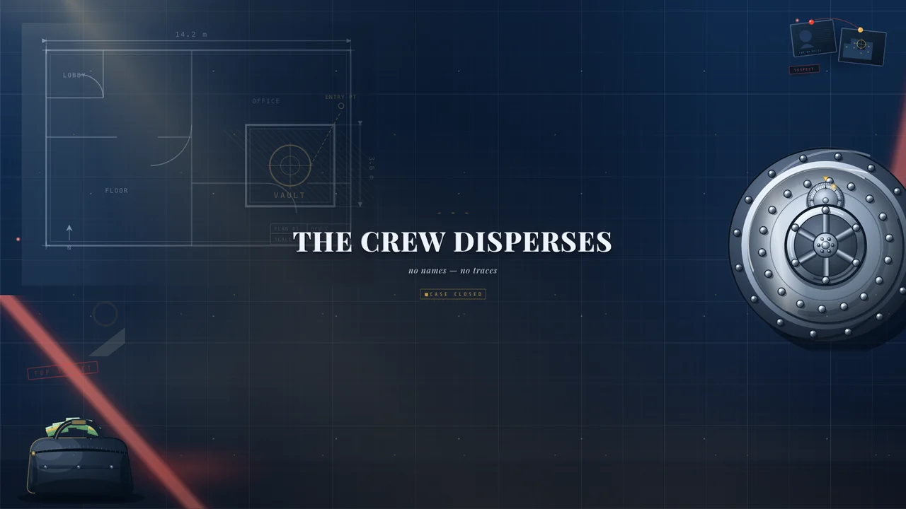

The end-credits as a heist crew reveal: a flashlight cone pans a navy blueprint, a brushed-steel vault door with a clicking dial and a gleam of gold behind it, red laser tripwires crossing the dark. Roles as section eyebrows, cuts of the take as amounts, a `THE SCORE` finale.
*Palette: blueprint navy + gold + laser red · widescreen serif/sans · vault + lasers.*

---

*Themes are generated from the theme lab in `prototype/` and shipped from `src/view/themes/`.
Regenerate the shots and this gallery after any theme change.*
